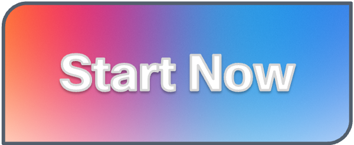
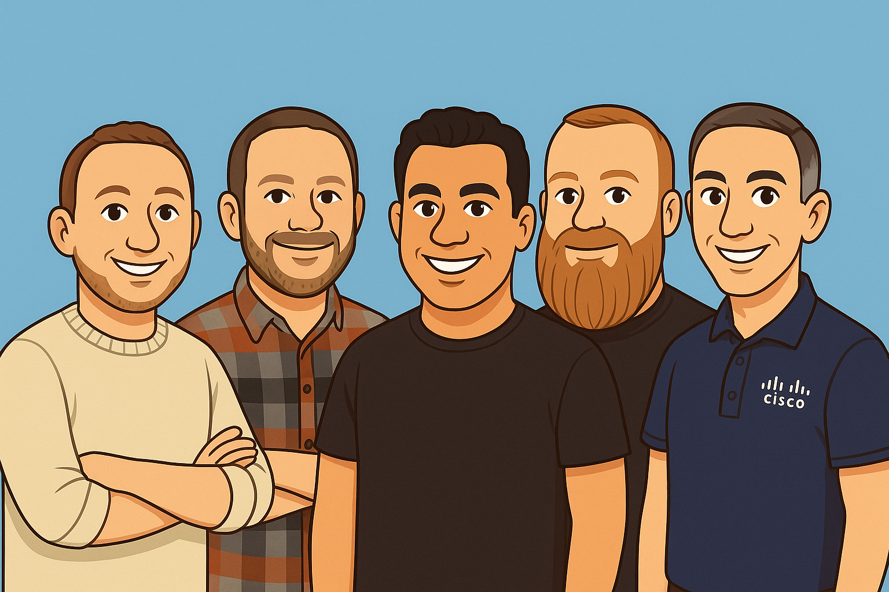

# Cisco Networking Academy Partner Workshop | Automation and AI

## A Hands-On Upskilling Workshop for NetAcad Instructors and Partners

### Your Instructors

- **Kareem Iskander**, Principal Technical Advocate | Learn with Cisco
- **Patrick Gargano**, Lead Content Advocate | Learn with Cisco
- **Alexander Stevenson**, Technical Advocate | Learn with Cisco
- **Quinn Snyder**, Senior Technical Advocate | Learn with Cisco
- **Hank Preston**, Distinguished Architect | Learn with Cisco

### What you will learn

> Through this two-day workshop, you will gain hands-on experience with network automation and AI concepts, tools, and techniques. By the end of the event, you will have a solid understanding of:
>
> - An understanding of generative AI and how it can be applied to general networking tasks
> - What prompt engineering is and how to create effective prompts for AI models
> - What RAG is and how it can be used to enhance AI-generated responses
> - An understanding of RESTCONF (device REST APIs) and how to interact with network devices using RESTCONF and Bruno
> - Understanding the basics of Python programming, data types, and functions
> - How to use Cisco Modeling Labs (CML) to create and manage network topologies
> - How to use Python to interact with network devices using libraries such as Netmiko
> - Where generative AI can be applied to network automation tasks, including generation of configuration snippets and exercise labs
> - What Model Context Protocol (MCP) is and how it be used to expand on the capabilities of AI models for automation and automated tasks

> At the conclusion of the workshop, you should not only feel much more confident about AI, automation, and the intersection of these technologies, but also ready to explore network automation within your own network environments and redeliver this content to your students.

### Assets

To fully complete this workshop, you will need access to a Cisco Modeling Labs server running version 2.9 or later, as the lab topologies use Docker containers, which are only supported in CML 2.9 and later.

The two lab topologies are available for download here:

- [Hands On Lab: AI Generated Network Configurations](https://raw.githubusercontent.com/CiscoLearning/CiscoU.-Workshop/refs/heads/main/assets/Hands_On_Lab__AI_Generated_Network_Configurations.yaml
)
- [Hands On Lab: Python Network Automation](https://raw.githubusercontent.com/CiscoLearning/CiscoU.-Workshop/refs/heads/main/assets/Hands_On_Lab__Python_Network_Automation.yaml)

If you have your own instance of Cisco Modeling Labs 2.9, you will need to follow [these instructions](https://github.com/CiscoDevNet/cml-community/tree/master/node-definitions/opensource/code-server-custom-4.102) to install the [CodeServer](https://hub.docker.com/r/linuxserver/code-server) container, which provides a web-based IDE for Python development.

If you do not have a Cisco Modeling Labs server available, a virtual image for a variety of hypervisors is available for download [at this Box link](https://cisco.app.box.com/folder/340062289300?s=hmrhjoshhzez3vlzdisvk0s9frn0lh5c).  This will provide an instance of Cisco Modeling Labs Free 2.9, with the containers already installed.
