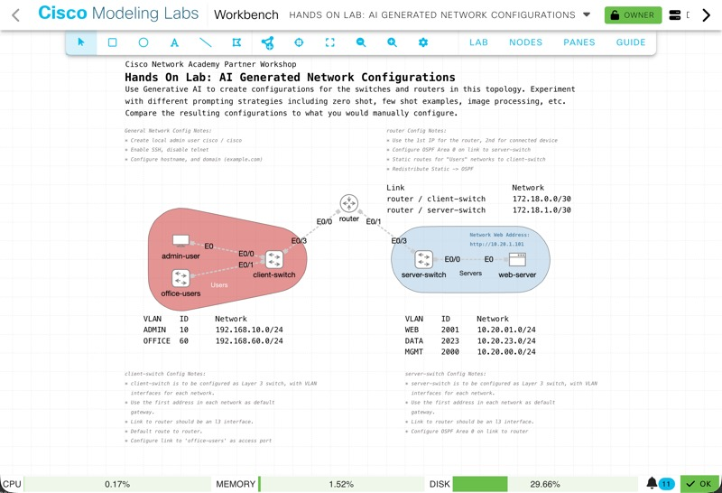

# Hands On Lab: AI Generated Network Configurations

## Introduction

Use Generative AI to create configurations for the switches and routers in this topology. In this lab do NOT create configurations by hand, solely rely on AI to see how it goes!

Experiment with different prompting strategies including zero shot, few shot examples, image processing, etc.

Compare the resulting configurations to what you would manually configure.  

This lab is part of the [Cisco U. | NetAcad Workshop] series.

## What You’ll Learn

In this lab, you will learn how to:

- Use Generative AI to create network configurations
- Use prompt engineering strategies to achieve the desired configurations
- Evaluate AI responses for accuracy and usability

## What You'll Need

- CML Server with Hands On Lab Topology
- ChatGPT or similar GenAI Tool. Free/anonymous account is sufficient

## Lab Steps

### Step 1: Start the Lab Topology

If the CML topology for this lab is not already imported into your CML server, go ahead and import it. Then Start the lab.

### Step 2: Prepare to Prompt

Review the configuration notes listed on the CML topology for the router and switches. Start planning how you'll use GenAI to create network configurations for each device. 

Consider:

* What prompting strategies will you try? (Suggest trying multiple to compare results)
* How will you break down the task? By device? By network feature?
* What details will you need to include in your prompt

### Step 3: Generate Configurations

Move to your GenAI tool, and being prompting to generate your configurations for the network devices `client-switch`, `server-switch`, and `router`. Feel free to iterate as you go, providing new details to achieve the result you want.

> Note: The `office-users` node is an unmanaged switch that requires no configuration. It is included on the topology to provide an additional access host connected to the `client-switch`

If you feel like you need to start over, no problem!  Just start a new conversation. You can also Stop/Wipe/Start the CML lab at anytime to start over.

### Step 4: Did it work?

Check to see if the network was configured correctly by attempting to navigate to the web-server from the `admin-user` host.  Use web address `http://10.20.1.101` from the web browser.

## Review and Wrap-Up

Excellent job!  In this lab you used GenAI to generate network configurations. Along the way you practiced different prompt engineering strategies and saw how GenAI's responses differ depending on the details you provided it.

Consider the following questions:

1. Did GenAI create the same configurations you would fhave done manually?
2. Was it faster/more efficient to use AI in this way? How could it have been better? 
3. Which prompting strategies were the most effective in achieving desired results?

## Clean Up

When you are done, stop and wipe your CML lab!

## Authors and Attribution

- Created by: Hank Preston
- Date: 09/2025
- Version: v1.1

