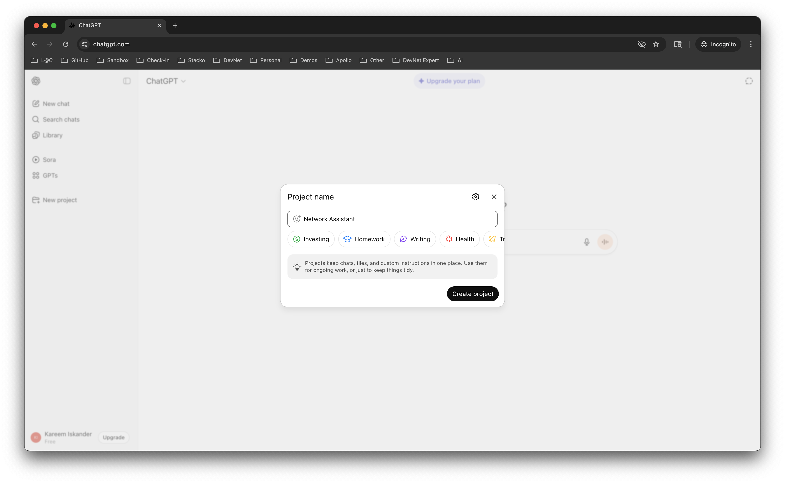
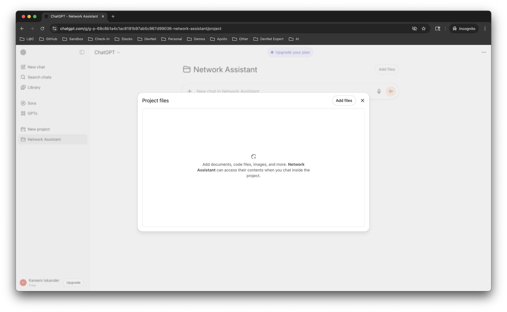
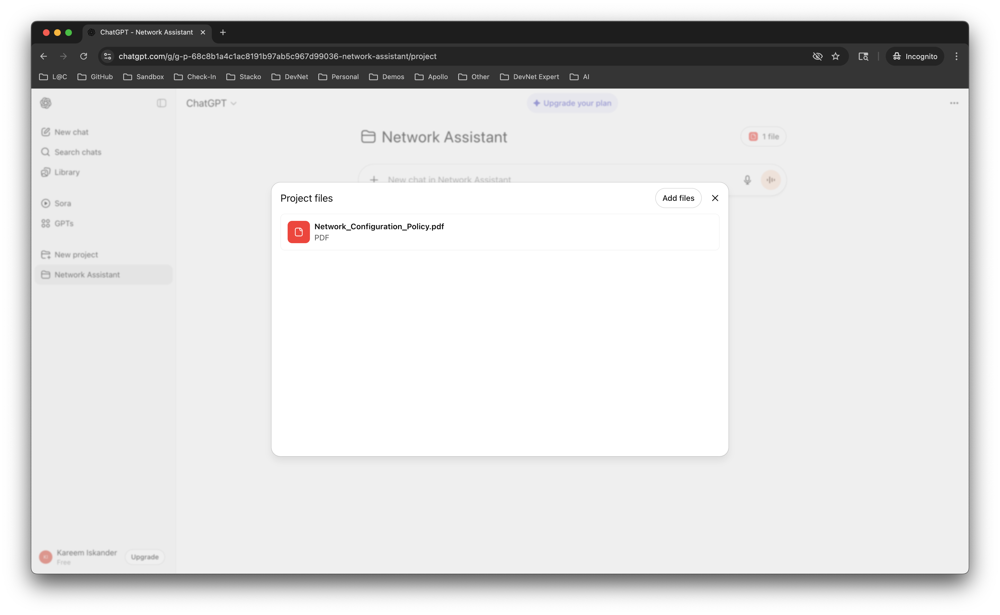
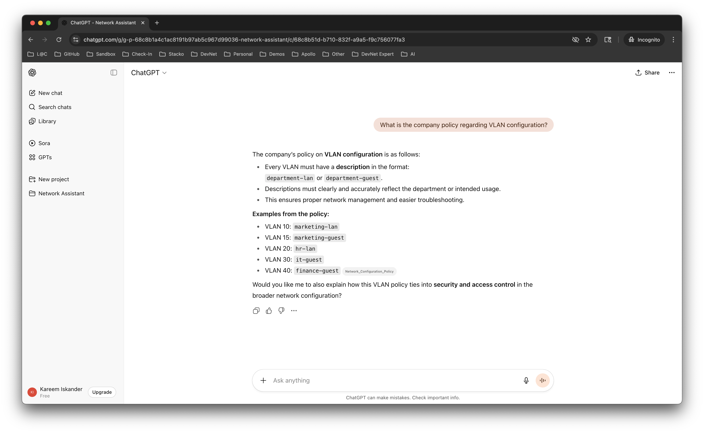

# Hands-on: Build a RAG Assistant for Network Policy Compliance


## Introduction

In this lab, you will build a simple retrieval-augmented generation (RAG) workflow using ChatGPT Projects to help a network engineer stay compliant with corporate configuration policies. You will create a new Project, upload a policy PDF into the Project’s knowledge base, ask grounded questions with citations, and run a compliance check against an example switch configuration.

---
🎯 Scenario

Imagine you're on the NetOps team at a large enterprise. Your manager sends you a config snippet and asks:  
**"Is this compliant with the latest network policy?"**

You open a 60-page PDF, CTRL+F your way through it… or, you use an assistant that can read the doc for you and tell you the answer.

That’s what you’ll simulate in this lab.

---

## What You’ll Learn

In this lab, you will learn how to:

- Create a new Project in `ChatGPT`
- Upload a policy PDF to the Project and ensure it’s indexed
- Ask grounded questions and interpret citations
- Run a compliance check on a switch configuration
- Monitor storage/usage and keep costs under control
- Clean up Projects and files

## What You'll Need

- An OpenAI account to [ChatGPT at chatgpt.com](https://chatgpt.com)
- **Download** 👉🏽[Policy PDF found](https://github.com/CiscoLearning/CiscoU.-Workshop/blob/dcdcdb9d7105d3d14b768bfcda5bac5dd1595712/day1/06-hands-on-rag-for-netengs/assets/Network_Configuration_Policy.pdf?raw=true)
- **Download** 👉🏽[Sample configuration](https://raw.githubusercontent.com/CiscoLearning/CiscoU.-Workshop/refs/heads/main/day1/06-hands-on-rag-for-netengs/assets/example-switch-config.cfg)
- A modern web browser

## Lab Steps

### Step 1: Create a Project on chatgpt.com

1) Sign in/Sign Up at [chatgpt.com](https://chatgpt.com) and navigate to Projects.

   

2) Click "New Project" and give it a name  `Network Assistant` and click on `Create Project`.

   

- Expected Outcome: You have a ChatGPT Project created with retrieval enabled.

> ⚠️ **Note:** This lab uses ChatGPT Projects to simulate a RAG system. It abstracts away the embedding and vector database steps.  
> You won’t write code or manage a backend — which makes it fast to learn, but also means you don’t control the system’s internals.

### Step 2: Time to feed our "RAG system" with knowledge files

1) Click on `Add Files` and click "Add Files".

   

2) Upload `assets/Network_Configuration_Policy.pdf` to the Project.

   

- Wait for the upload to take place, chunking and indexing to complete. This can take a few minutes.


### Step 3: Ask the Project for Policy Details

Open the Project chat (thread) associated with your Project and use the following prompts.

**Prompt 1:**

```text
What is the company policy regarding VLAN configuration?
```

   

- Expected Result: A grounded answer citing the policy (look for citation markers and source references).

   

**Prompt 2:**

```text
Briefly describe what kind of information I can find in the file?
```

### Step 4: Run a Compliance Check Against a Switch Configuration

Use the example config located at `assets/example-switch-config.cfg`.

**Prompt 3:**

```text
Act as Network Engineer with years of Networking knowledge and tell me if the following configuration compliant with the company policy
```

Then paste the full contents of `assets/example-switch-config.cfg` after the `prompt`.

## Review and Wrap-Up

You built a working RAG workflow using ChatGPT Projects: created a Project with retrieval, uploaded a policy PDF into the Project, asked grounded policy questions with citations, and ran a configuration compliance check. You also learned how to monitor usage and perform a complete cleanup.

Consider extending this workflow with additional policy documents, device types, or programmatic automation where available.

**Questions to reflect on:**

- What kinds of documents could you upload beyond policies?
- What are the limitations of using a managed retrieval system like this?
- How might this approach change your day-to-day workflows?

## Clean Up

- remove files and Projects you no longer need.

## Authors and Attribution

- Created by: Kareem Iskander
- Date: 09/2025
- Version: v1.0


<p align="center">
<a href="../05-rag/1.md"></a>
<a href="../../day2/01-why-automation/1.md"></a>
</p>