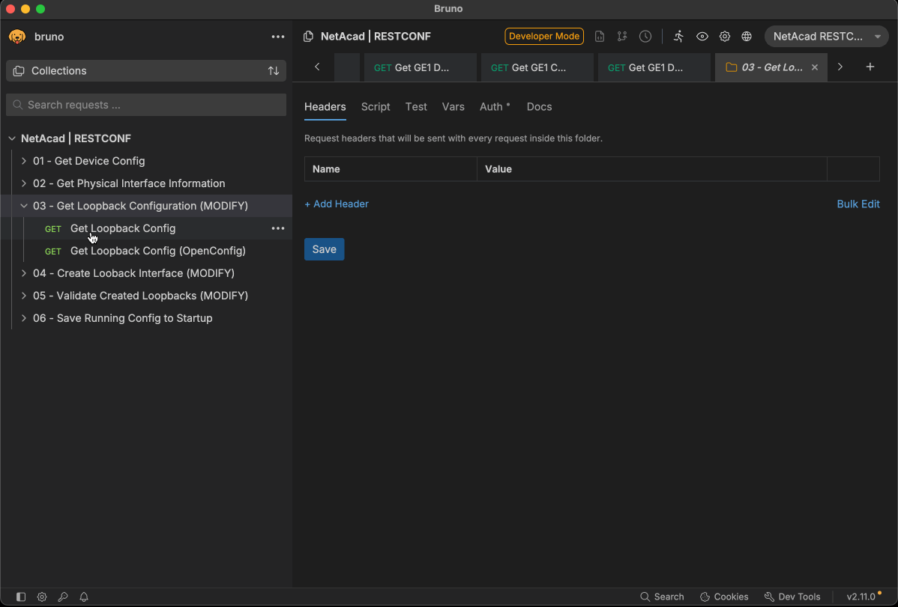

# Hands-on with RESTCONF using Bruno


## Introduction

In this lab, we will explore RESTCONF, a protocol used for accessing data defined in YANG, using Bruno, a RESTCONF client. We will perform various operations such as retrieving and creating configurations on a network device.  We will also use the code generation capabilities of Bruno to create a Python script that interacts with the RESTCONF API using the `requests` library.

While Bruno (and similar tools like Postman, RapidAPI, and the Thunder Client) are generally used in the context of web APIs, they can also be effectively utilized for network device management through RESTCONF, which allows for network configuration using the device's YANG models over HTTP, with JSON payloads. This lab will guide you through the process of using Bruno to interact with a network device's RESTCONF API.

## What You'll Learn

- How to navigate and use Bruno
- How to import a collection and environment within Bruno
- How to modify variables within an environment inside of Bruno
- How to perform GET and POST requests using Bruno against a RESTCONF API
- How to generate `cURL` requests using the code generation feature in Bruno
- How to generate Python code using the `requests` library from Bruno

## What You'll Need

- A computer with internet access
- Bruno installed on your computer (you can download it from [Bruno's official website](https://www.usebruno.com/))
  - For the collection included within the repository, a minimum of Bruno 2.11.0 is required
  - While a VSCode extension for Bruno exists, we will be using the standalone application for this lab
- Access to a network device that supports RESTCONF (e.g., Cisco IOS XE router or switch)
  - For this lab, we will use a dedicated Catalyst 8000v router running in a cloud environment
  - To use this collection and lab after the event, you can reserve a free lab at [Cisco DevNet Sandbox](https://devnetsandbox.cisco.com/DevNet).  Use the Always-On Catalyst 8000v sandbox, which requires a free DevNet account to access.  Instructions for accessing the sandbox can be found [at this link](./sbx.md)
- The RESTCONF collection and environment files provided in this repository

## Lab Steps

### Step 0: Download the Bruno Collection from Github

1. Download the collection file from this repostory by right-clicking on [this link](https://raw.githubusercontent.com/CiscoLearning/CiscoU.-Workshop/refs/heads/main/day2/03-hands-on-bruno-restconf/code/NetAcad%20_%20RESTCONF.json) and saving the file to your local machine.  Remember where you saved it!

### Step 1: Open Bruno and Import the Collection and Environment

Download the RESTCONF collection and environment files (if you did not do so in Step 0) from this repository [this link](https://raw.githubusercontent.com/CiscoLearning/CiscoU.-Workshop/refs/heads/main/day2/03-hands-on-bruno-restconf/code/NetAcad%20_%20RESTCONF.json). Open Bruno and import the collection and environment files by following these steps:

1. Launch the Bruno application.
2. Under the file menu, select "Open Collection"
3. Select the downloaded collection file (this will be in `.json` format).  The collection will include both the prebuilt API requests and the environment file.
4. Click "Open" to import the files into Bruno.

    > Note: If you receive an error during import indicating that the collection is not compatible with your version of Bruno, please ensure you are using Bruno version 2.11.0 or later.

    

### Step 2: Examine the Environment Variables

1. In Bruno, navigate to the "Environments" button on the right side of the window.
2. Select the "NetAcad RESTCONF Lab" environment from the dropdown menu.
3. After the environment has been activated, you'll receive a notification at the top of the Bruno window indicating that the environment is active.
4. Click the "NetAcad RESTCONF Lab" environment button (in the same location as the previous step) and select the "Configure" option.  This will bring up a new window which will allow you to see the environment variables that have been pre-configured for this lab.
5. Each of these is preconfigured for this lab.  If you wish to use this collection elsewhere, you can click into each variable and modify the value (or name) as needed.  For this lab, you will not need to modify any of these values.
6. Pay close attention to the variable names, as we will use these names in the API requests (they are enclosed in double curly braces, e.g., `{{variable_name}}`).
7. Click "Save" to close the environment configuration window.
8. Finally, we'll inspect the collections authorization settings, which will be used for every request within the top level folder.  Click on the "NetAcad | RESTCONF" folder on the left side of the window to select it.  Then, click on the "Auth" tab in the main window.  You will see that "Basic Auth" has been selected as the authorization type, and that the username and password fields are set to `{{username}}` and `{{password}}`, respectively.  This means that for every request within this folder (and its subfolders), Bruno will use Basic Authentication with the username and password defined in the environment variables.

    > Note: You may need to click on the "eye" icon next to the password field to view the text in the field.

    

### Step 3: Inspect the Collection and the Pre-built Requests

1. After the collection has been opened, you will see a top level folder named "NetAcad | RESTCONF".  This is the collection of API calls that have been prepared for you.
2. Click the arrow to the left of the folder name to expand it and view the individual API requests.  The requests are organized into numerical subfolders that show a progression of tasks.  You will also see some requests that have "(OpenConfig)" in the name.  These requests use OpenConfig YANG models instead of Cisco native YANG models.
3. Click on the arrow next to the first folder named "01 - Get Device Config" and then click on "Get Device Config (Top Level)" to open the first API request.
4. In the main window, you will see the details of the API request, including the HTTP method (GET), the URL, and in the window below the URL, you will see a window with various tabs such as "Params", "Body", "Headers", etc.  These tabs allow you to modify the request as required by the end device, as well as any configuration payloads that you wish to send.
5. Click on each tab and view what has been configured.  A list of explation is given below:
    - **Params**: This tab is used to add query parameters to the URL.  In this case, no parameters are needed, so this tab is empty.
    - **Body**: This tab is used to add a request body for methods like POST or PUT.  Since this is a GET request, no body is needed, so this tab is empty.
    - **Headers**: This tab is used to add HTTP headers to the request.  In this case, two headers have been added:
        - `Accept: application/yang-data+json` - This header indicates that we want the response in JSON format.
        - `Content-Type: application/yang-data+json` - This header indicates that the request body (if any) will be in JSON format.
    - **Auth**: This tab is used to add authentication to the device.  In this case, Basic Auth has been inherited from the top level of the collection.  The username and password are pulled from the environment variables `{{username}}` and `{{password}}`.
    - The remaining tabs ("Pre-request Script", "Tests", "Settings") are not used in this lab, so you can ignore them for now, however, they allow for advanced functionality such as scripting and custom settings for the request.

    

6. The URL for the request is `https://{{hostname}}:{{port}}/restconf/data/Cisco-IOS-XE-native:native/`.  The `{{hostname}}` and `{{port}}` variables will be replaced with the values defined in the environment when the request is sent.  Click into the address bar and click "Enter" to send the request.  The data returned should be similar to the following snippet (the exact output may vary based on the device configuration; the full configuration is not shown here for brevity):

    ```json
    {
      "Cisco-IOS-XE-native:native": {
        "version": "17.9",
        "boot-start-marker": [
          null
        ],
        "boot-end-marker": [
          null
        ],
        "memory": {
          "free": {
            "low-watermark": {
              "processor": 63676
            }
          }
        },
    ....
    ```

7. The response will also include a status code and response time at the top of the window.  A status code of `200 OK` indicates that the request was successful.

    

### Step 4: Exploring OpenConfig Models and Refining GET Requests

1. Next, we will explore several GET requests and compare the difference between native and OpenConfig YANG models.  Click on the arrow next to the folder named "02 - Get Physical Interface Information" and then click on "Get GE1 Config" to open the first API request in this folder.  This request uses the native YANG model to retrieve the configuration of the GigabitEthernet1 interface.
2. This request should look very similar to the previous request, with the exception of the URL, which is now `https://{{hostname}}:{{port}}/restconf/data/Cisco-IOS-XE-native:native/interface/GigabitEthernet=1/`.  The information contained within this response is actually included in the full reply to the API we queried in the previous step if you were to scroll to the "interfaces" section of the response.  This illustrates the way that RESTCONF allows you to retrieve specific sections of the configuration by appending the appropriate path to the URL.  The response should be similar to the following snippet (the exact output may vary based on the device configuration):

    ```json
    {
      "Cisco-IOS-XE-native:GigabitEthernet": [
        {
          "name": "1",
          "description": "TESTING RESTCONF INFORMATION (DO NOT DELETE)",
          "switchport": {
            "Cisco-IOS-XE-switch:trunk": {
              "native": {
                "vlan-config": {
                  "tag": true
                }
              }
            }
          },
          "ip": {
            "address": {
              "dhcp": {}
            },
            "Cisco-IOS-XE-nat:nat": {
              "outside": [
                null
              ]
            }
          },
          "ipv6": {
            "address": {
              "dhcp": {}
            },
            "enable": [
              null
            ],
            "nd": {
              "Cisco-IOS-XE-nd:autoconfig": {
                "default-route": [
                  null
                ]
              }
            }
          },
          "logging": {
            "event": {
              "link-status": [
                null
              ]
            }
          },
          "access-session": {
            "host-mode": "multi-auth"
          },
          "Cisco-IOS-XE-ethernet:negotiation": {
            "auto": true
          }
        }
      ]
    }
    ```

3. To further illustrate the nesting of information within the RESTCONF response, note the description key-value pair in the response you received (or in the snippet above).  We can drill down to this key (or any other key, such as IP address, shutdown state, etc) by appending the key name to the URL.  Click on the "Get GE1 Description" request in the same folder to open it.  The URL for this request is `https://{{hostname}}:{{port}}/restconf/data/Cisco-IOS-XE-native:native/interface/GigabitEthernet=1/description`.  Click into the address bar and click "Enter" to send the request.  The response should be similar to the following snippet:

    ```json
    {
      "Cisco-IOS-XE-native:description": "TESTING RESTCONF INFORMATION (DO NOT DELETE)"
    }
    ```

    

4. Next, we will compare the native YANG model to the OpenConfig YANG model.  Click on the "Get GE1 Config (OpenConfig)" request in the same folder to open it.  The URL for this request is `https://{{hostname}}:{{port}}/restconf/data/openconfig-interfaces:interfaces/interface=GigabitEthernet1/`.  Notice the fact that the path now includes `openconfig-interfaces:interfaces` instead of `Cisco-IOS-XE-native:native/interface` and that the interface name is referenced as a parameter to the `interface` key instead of as part of the path.  The other difference will be in the response itself.  Click into the address bar and click "Enter" to send the request.  The response should be similar to the following snippet (the full response is not included here for brevity):

    ```json
    {
      "openconfig-interfaces:interface": [
        {
          "name": "GigabitEthernet1",
          "config": {
            "name": "GigabitEthernet1",
            "type": "iana-if-type:ethernetCsmacd",
            "description": "TESTING RESTCONF INFORMATION (DO NOT DELETE)",
            "enabled": true
          },
          "state": {
            "name": "GigabitEthernet1",
            "type": "iana-if-type:ethernetCsmacd",
            "description": "TESTING RESTCONF INFORMATION (DO NOT DELETE)",
            "enabled": true,
            "ifindex": 1,
            "admin-status": "UP",
            "oper-status": "UP",
            "last-change": "1759341589443000000",
            "counters": {
              "in-octets": "165055",
              "in-unicast-pkts": "2119",
              "in-broadcast-pkts": "0",
              "in-multicast-pkts": "0",
              "in-discards": "0",
              "in-errors": "0",
              "in-unknown-protos": "0",
              "in-fcs-errors": "0",
              "out-octets": "193994",
              "out-unicast-pkts": "1670",
              "out-broadcast-pkts": "0",
              "out-multicast-pkts": "0",
              "out-discards": "0",
              "out-errors": "0",
              "last-clear": "1759341495000000000"
            }
          },
          "subinterfaces": {
            "subinterface": [
              {
                "index": 0,
                "config": {
                  "index": 0,
                  "description": "TESTING RESTCONF INFORMATION (DO NOT DELETE)",
                  "enabled": true
                },
                "state": {
                  "description": "TESTING RESTCONF INFORMATION (DO NOT DELETE)",
                  "enabled": true,
                  "name": "GigabitEthernet1",
                  "ifindex": 1,
                  "admin-status": "UP",
                  "oper-status": "UP",
                  "last-change": "1759341589443000000",
                  "counters": {
                    "in-octets": "165055",
                    "in-unicast-pkts": "2119",
                    "in-broadcast-pkts": "0",
                    "in-multicast-pkts": "0",
                    "in-discards": "0",
                    "in-errors": "0",
                    "in-unknown-protos": "0",
                    "in-fcs-errors": "0",
                    "out-octets": "193994",
                    "out-unicast-pkts": "1670",
                    "out-broadcast-pkts": "0",
                    "out-multicast-pkts": "0",
                    "out-discards": "0",
                    "out-errors": "0",
                    "last-clear": "1759341495000000000"
                  }
                },
          ....
    ```

5. Finally, lets examine gathering the description from the GE1 interface using the OpenConfig model.  Click on the "Get GE1 Description (OpenConfig)" request in the same folder to open it.  The URL for this request is `https://{{hostname}}:{{port}}/restconf/data/openconfig-interfaces:interfaces/interface=GigabitEthernet1/config/description`.  Click into the address bar and click "Enter" to send the request.  The response should be similar to the following snippet:

    ```json
    {
      "openconfig-interfaces:description": "TESTING RESTCONF INFORMATION (DO NOT DELETE)"
    }
    ```

    However, if we go back to the original request for the full configuration, we can see that the description is defined in several places. This is because the OpenConfig model defines the description in multiple places, such as under `config` and `state`.  The `config` section represents the intended configuration, while the `state` section represents the actual state of the interface.  In this case, both sections contain the same description, but they can differ in other scenarios, depending on the vendor's implementation of configuration changes (e.g. automatic or using a two-stage commit process).  If we wanted to retrieve the description from the `state` section, we would need to modify the URL to `https://{{hostname}}:{{port}}/restconf/data/openconfig-interfaces:interfaces/interface=GigabitEthernet1/state/description`.  Modify the existing OpenConfig GE1 description request and send the request again.  The response should be similar to the following snippet:

    ```json
    {
      "openconfig-interfaces:description": "TESTING RESTCONF INFORMATION (DO NOT DELETE)"
    }
    ```

    

### Step 5: Analyzing Invalid GET Requests

1. This step will build on the previous steps and illustrate the responses when interfaces do not exist on the device being queried.  Within Bruno, click on the folder named "03 - Get Loopback Configuration (MODIFY)".  This folder contains two GET requests for loopback interfaces, one using native models and one using OpenConfig.  Open the native model request and change the referenced loopback to one that does not exist on the device currently (we recommend adding 100 to your position within the room, but any number will suffice as long as its under 255).  Remember this number, as we will use it for future steps.  When you send the request to the device, you should receive a response similar to the following:

    ```json
    {
      "ietf-restconf:errors": {
        "error": [
          {
            "error-type": "application",
            "error-tag": "invalid-value",
            "error-message": "uri keypath not found"
          }
        ]
      }
    }
    ```

2. Next, open the OpenConfig request and modify the loopback interface another unique number (add 1000 to the number used in the previous step to ensure uniqueness).  When you send the request to the device, you should receive a response similar to the following:

    ```json
    {
      "ietf-restconf:errors": {
        "error": [
          {
            "error-type": "application",
            "error-tag": "invalid-value",
            "error-message": "uri keypath not found"
          }
        ]
      }
    }
    ```

3. Notice that both responses are the same, indicating that the requested resource was not found on the device, but that the response received is not dependent on the model being queried (making error handling much simpler).  This is a common response when querying for non-existent resources using RESTCONF.

    

### Step 6: Creating Configurations Using POST Requests

1. In this step, we will create a new loopback interface on the device using both native and OpenConfig models.  Click on the folder named "04 - Create Loopback Interface (MODIFY)" to expand it.  This folder contains two POST requests for creating loopback interfaces, one using native models and one using OpenConfig.  Open the native model request first.

2. Modify the URL in the address bar to reflect the loopback number you used in the previous step (the one that does not exist on the device).  The URL should be `https://{{hostname}}:{{port}}/restconf/data/Cisco-IOS-XE-native:native/interface/Loopback={{loopback_number}}`, where `{{loopback_number}}` is the number you chose.  You will also need to modify the body of the request to include the configuration for the new loopback interface.  Click on the "Body" tab below the URL .  Replace the existing JSON with the following, ensuring that you replace `{{loopback_number}}` with your chosen number:

    ```json
    {
      "Cisco-IOS-XE-native:Loopback": {
        "name": {{loopback_number}},
        "description": "Created via RESTCONF and native models using Bruno",
        "ip": {
          "address": {
            "primary": {
              "address": "192.0.2.{{loopback_number}}",
              "mask": "255.255.255.255"
            }
          }
        }
      }
    }
    ```

    When you are ready, click into the address bar and click "Enter" to send the request.  If successful, you should receive a `201 Created` status code with no body in the response (and the response screen will be blank or white).  Note the different status code than previous 200 OK responses; error codes returned from HTTP requests will provide insight into the success or failure of the request.  A complete list of HTTP status codes can be found [here](https://en.wikipedia.org/wiki/List_of_HTTP_status_codes).

3. While the IP address we used in the body of the request should be unique to each attendee, if you attempt to apply an address that is already in use, you may receive a 400 Bad Request error with a response similar to the following:

    ```json
    {
      "ietf-restconf:errors": {
        "error": [
          {
            "error-type": "application",
            "error-tag": "invalid-value",
            "error-path": "/Cisco-IOS-XE-native:native/interface/Loopback[name='200']",
            "error-message": "inconsistent value: Device refused one or more commands"
          }
        ]
      }
    }
    ````

    If this happens, change the last octet of the IP address in the body of the request to a different number (between 1 and 254) and try sending the request again.

4. Next, open the OpenConfig request in the same folder.  Modify the URL in the address bar to reflect the loopback number you chose when querying the loopbacks using OpenConfig models (the one that does not exist on the device).  The URL should be `https://{{hostname}}:{{port}}/restconf/data/openconfig-interfaces:interfaces/interface=Loopback{{loopback_number}}`, where `{{loopback_number}}` is the number you chose.  You will also need to modify the body of the request to include the configuration for the new loopback interface.  Click on the "Body" tab below the URL .  Replace the existing JSON with the following, ensuring that you replace `{{loopback_number}}` with your chosen number:

    ```json
    {
      "openconfig-interfaces:interface": {
        "name": "Loopback{{loopback_number}}",
        "config": {
          "name": "Loopback{{loopback_number}}",
          "description": "Created via RESTCONF and OpenConfig models using Bruno",
          "type": "iana-if-type:softwareLoopback",
          "enabled": true
        },
        "subinterfaces": {
          "subinterface": [
            {
              "index": 0,
              "config": {
                "index": 0,
                "enabled": true
              },
              "ipv4": {
                "addresses": {
                  "address": [
                    {
                      "ip": "192.0.3.{{loopback_number}}",
                      "config": {
                        "ip": "192.0.3.{{loopback_number}}",
                        "prefix-length": 32
                      }
                    }
                  ]
                }
              }
            }
          ]
        }
      }
    }
    ```

    When you are ready, click into the address bar and click "Enter" to send the request.  If successful, you should receive a `201 Created` status code with no body in the response (and the response screen will be blank or white).

5. While the IP address we used in the body of the request should be unique to each attendee, if you attempt to apply an address that is already in use, you may receive a 400 Bad Request error with a response similar to the following:

    ```json
      {
        "ietf-restconf:errors": {
          "error": [
            {
              "error-type": "application",
              "error-tag": "invalid-value",
              "error-path": "/openconfig-interfaces:interfaces/interface[name='Loopback201']",
              "error-message": "inconsistent value: Device refused one or more commands"
            }
          ]
        }
      }
    ```

    If this happens, change the last octet of the IP address in the body of the request to a different number (between 1 and 254) and try sending the request again.

6. Notice the payload that was sent in the OpenConfig request.  While there is a lot of information received from the GET request, we only needed to include the required fields in the POST request to create the loopback interface.  This is a key feature of RESTCONF, as it allows you to create or modify configurations without needing to send the entire configuration.  In this case, we only sent information pertaining to the "subinterface 0" of the loopback interface, which pertains to the "physical" interface itself.

    

### Step 7: Verifying the Created Configurations

1. In this step, we will verify that the loopback interfaces were created successfully on the device.  Click on the folder named "05 - Validate Created Loopbacks (MODIFY)" to expand it.  This folder contains two GET requests for verifying the loopback interfaces, one using native models and one using OpenConfig, similar to what we did in Step 5.  Open the native model request first.

2. Modify the URL in the address bar to reflect the loopback number you used in Step 5, 6 (the one that you created).  Ensure that you receive valid data back that reflects the configuration you applied in Step 6.

3. Next, open the OpenConfig request in the same folder.  Modify the URL in the address bar to reflect the loopback number you used in Step 5, 6 (the one that you created).  Ensure that you receive valid data back that reflects the configuration you applied in Step 6.

    

4. As with any configuration change, it is important to ensure the configuration changes made reflect the desired state.  This is especially true when using automation tools, as a small mistake in the code can lead to significant issues.  Always verify your changes!

5. Finally, lets save our changes.  Open the folder titled "06 - Save Running Configuration to Startup" and open the "Save Config" request.  This request uses a POST method with an empty JSON body to save the running configuration to the startup configuration on the device.  The URL for this request is `https://{{hostname}}:{{port}}/restconf/operations/cisco-ia:save-config`.  Click into the address bar and click "Enter" to send the request.  If successful, you should receive a `200 OK` status code with a response similar to the following snippet:

    ```json
    {
      "cisco-ia:output": {
        "result": "Save running-config successful"
      }
    }
    ```

### Step 8: Generating Code from Requests in Bruno

1. The final aspect of this lab will illustrate the code generation capabilities of Bruno.  This feature allows you to generate code snippets in various programming languages based on the API requests you have built in Bruno.  This can be especially useful for network engineers who want to automate tasks using scripts.  We'll cover two different methods: generating `cURL` commands and generating Python code using the `requests` library.

2. To generate a `cURL` command, click on the "Code" button located at the top right corner of the request panel.  From the dropdown menu, select "Shell", and then click on the "cURL" button (if it is not already selected).  Bruno will automatically generate a `cURL` command that replicates the API request you have built.  You can copy this command and use it in your terminal or command prompt.  Perform this function on any of the GET requests you have built in this lab to see how the `cURL` command is constructed.

3. Notice that the cURL command includes the URL, headers, and authentication information.  However, the authentication information won't be the username and password, but a base64 encoded string of these values.  This is because of our selection of "basic authentication" for the collection.  Rather than having to manually generate this encoding, Bruno is handling this for us with our provided username and password.  We can validate the base64 encoding by using an online tool such as [base64encode.org](https://www.base64encode.org/), or we can use the CLI.  Using one of these tools, decode the included base64 string to verify that it matches the username and password you are using for this lab.  You should receive the following output:

    ```bash
    echo -n e3t1c2VybmFtZX19Ont7cGFzc3dvcmR9fQ== | base64 -d
    {{username}}:{{password}}
    ```

    

4. This reflects that Bruno does not store your username and password in the generated cURL command, which requires us to manually input the appropriate value for this variable.  Use the same tool to generate a base64 encoded string of the username and password using the format `username:password` (e.g., `admin:password`).  You should receive a string similar to the following (the exact string will vary based on your username and password):

    ```bash
    echo -n npe-restconf:C1sco12345 | base64
    bnBlLXJlc3Rjb25mOkMxc2NvMTIzNDU=
    ```

5. Once you have generated this string, replace the authorization header in the cURL command and paste the complete command into your terminal or command prompt to execute it.  You should receive a response similar to what you received in Bruno.

6. To generate Python code using the `requests` library, click on the "Code" button again and select "Python" and click on the "requests" button.  Bruno will generate a Python code snippet that uses the `requests` library to perform the same API request.  You can copy this code and use it in your Python scripts.  While we won't be invoking this code during the exercise, its important to understand how Bruno can generate code snippets that can be used to provide sample code for automating tasks.  Keep in mind that in order to use this code, you will need to update the authorization string in the headers to use the base64 encoded string you generated in the previous step.

## Review and Wrap-Up

Congratulations!  You have completed the lab and have gained hands-on experience with RESTCONF using Bruno.  You have learned how to navigate and use Bruno, import collections and environments, modify environment variables, perform GET and POST requests, and generate code snippets in `cURL` and Python.

Now that you've learned how to explore APIs, we'll begin to dive deeper into Python with the next several labs, which will include basic Python skills as well as automating network tasks using Netmiko.

## Clean Up

No clean up or lab teardown is required.  You can safely close Bruno with or without saving the collection (it will ask if you wish to save the updated requests, since they were modified to reflect different loopback numbers and IP addresses).

## Additional Resources

## Authors and Attribution

Created by: [Quinn Snyder; qsnyder@cisco.com]

Date: [10/2025]

Version: [v1.0]


<p align="center">
<a href="../02-intro-to-apis/1.md"></a>
<a href="../04-intro-to-python/1.md"></a>
</p>
