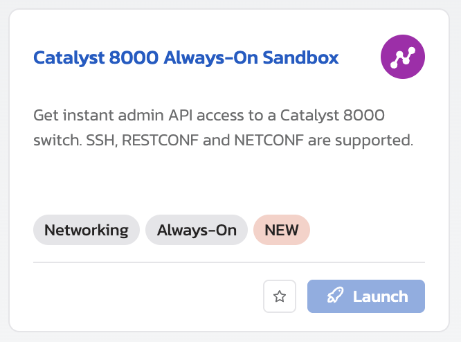

# Accessing the Catalyst 8000v Sandbox

To use this collection and lab after the event, you can reserve a free lab at [Cisco DevNet Sandbox](https://devnetsandbox.cisco.com/DevNet).  Use the Always-On Catalyst 8000v sandbox, which requires a free DevNet account to access.  Instructions for accessing the sandbox can be found below.

1. Go to the [Cisco DevNet Sandbox](https://devnetsandbox.cisco.com/DevNet) website.
2. Sign in with your DevNet account or create a new account if you don't have one.
3. Once logged in, navigate to the "Catalyst 8000 Always-On Sandbox" tile.

    

4. Even though the lab is always on, you still need to reserve it.  Click the "Launch" button to reserve the lab.
5. The lab should automatically launch.  You will receive an email to the address within your account with the lab details, including the username and password that you should use.  The DevNet Sandbox environments no longer use static credentials for every user, so be sure to use the credentials provided in your email.
6. Modify the environment variables in Bruno to match the lab details provided in your email.  The hostname will be the IP address of the router, and the username and password will be as provided in your email.  The port should remain `443` unless otherwise specified in your email.

**You can now access the Catalyst 8000v sandbox using the Bruno collection and complete the lab!**