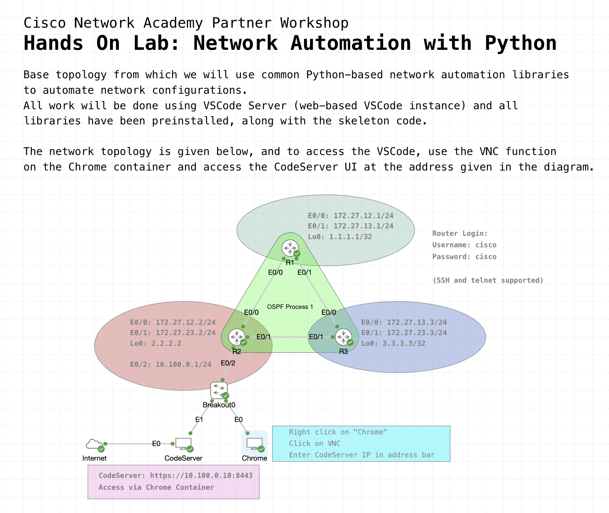
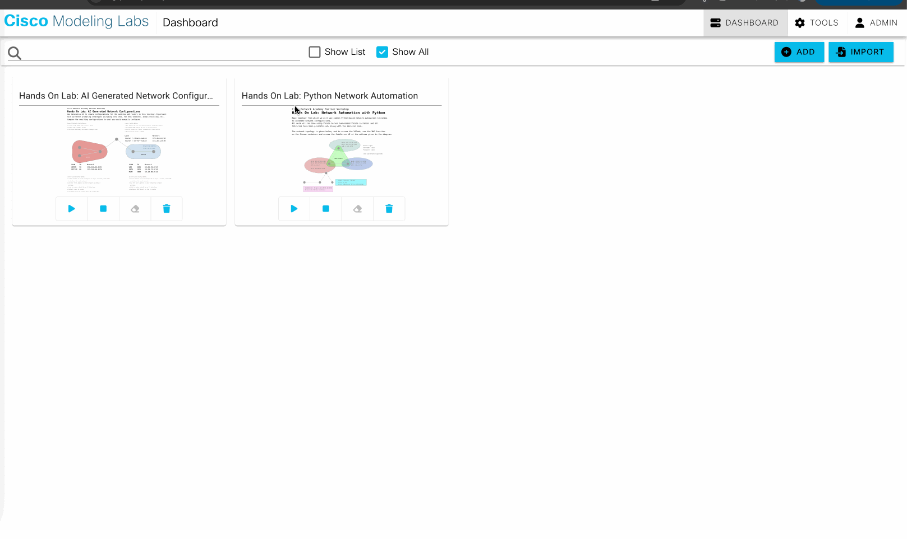
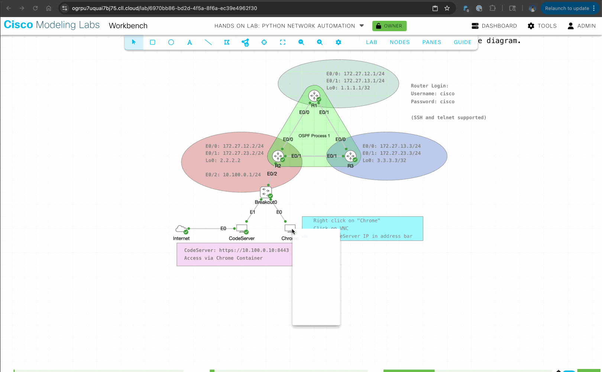
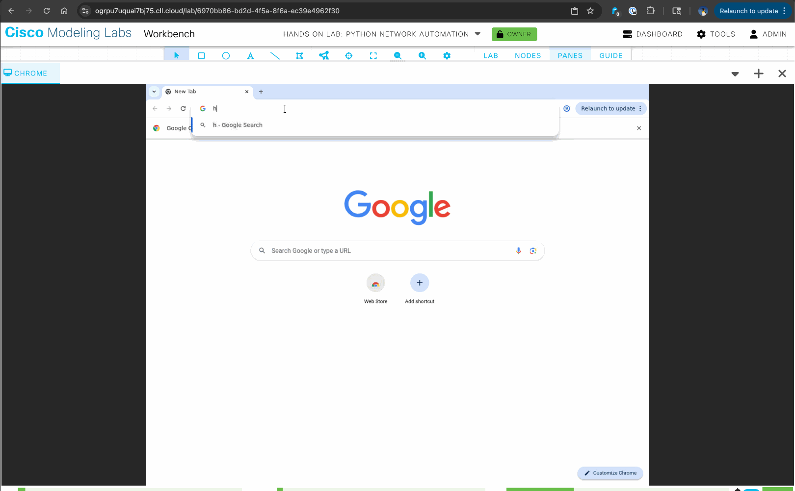
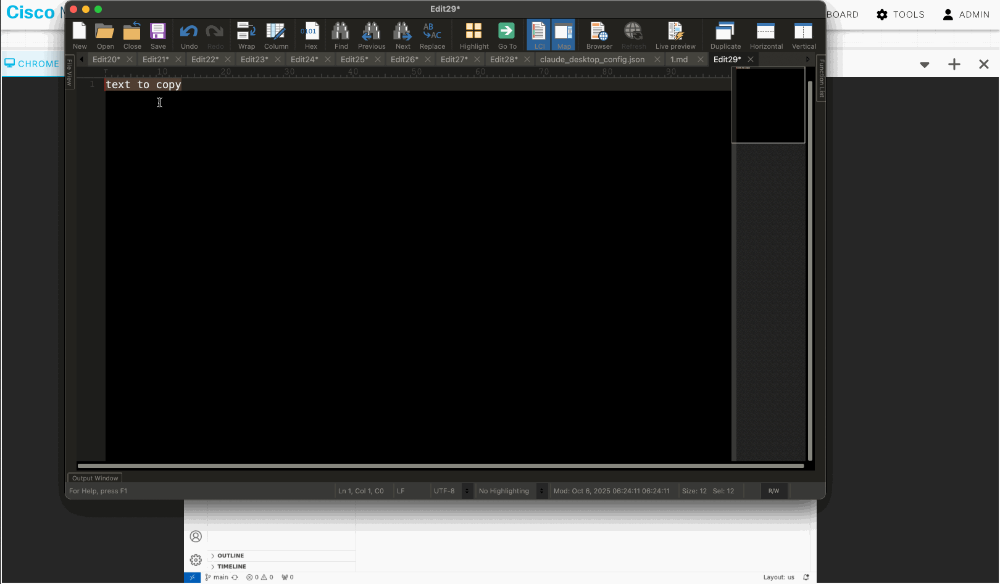
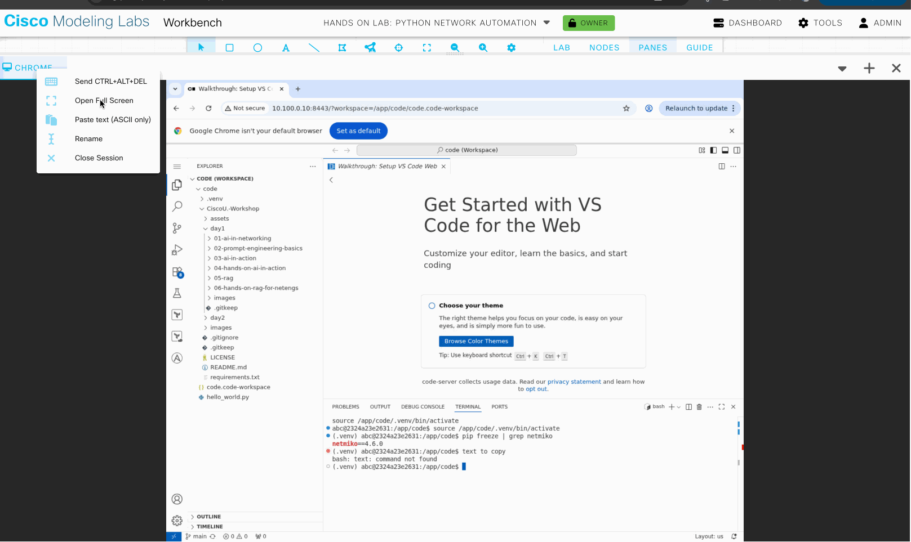

# Netmiko Automation Hands-on


## Introduction

This Lab introduces learners to the practical use of Python with Netmiko, a Python library (or more precisely, a third-party package) that simplifies SSH connections to network devices.

Instead of logging in manually and typing commands, you will use *automation* to connect, run commands, and capture output from Cisco devices running inside Cisco Modeling Labs (CML).

This is the first step toward replacing repetitive CLI tasks with scripts that scale, a core skill in network automation.

This lab builds directly on the Python hands-on lab you should have completed earlier.

## What You’ll Learn

In this Lab, you will learn how to:

- Install and import the Netmiko library into your Python virtual environment.
- Connect to Cisco devices running in CML over SSH using Netmiko.
- Send CLI commands programmatically and capture the output.
- Use Python lists, dictionaries, and loops (skills from the Python hands-on) to automate tasks across multiple devices.

## What You'll Need

- A client computer
- Internet access to the Cisco Modeling Labs topology

### The Network Topology

This topology will serve as the network that you'll be automating against.  All device hostnames, IPs, and credentials are provided.  

> Note: You must access the routers using their interface IPs.  Access via loopback is not possible using this lab.



## Lab Steps

### Step 0: Access the Cisco Modeling Labs Code Server

> Note: This step is the same as the previous Python lab. If you are familiar with how to access the CodeServer environment, you can skip this step.

> Note: if at any time you are unsure of the solution to the code that you're asked to complete below, you can reference the `solutions` directory under `code/solutions`.

1. Open a web browser and navigate to the URL of your CML server. Log in with your credentials (these will be provided by your instructor).

2. Locate the topology named `Hands On Lab: Python Network Automation`, click on it, click on the "Lab" menu at the top of the window, and select "Start Lab".

    

3. Once the topology is running, let it stay in the 'started' state for a few minutes. This ensures that the development environment is fully initialized with the code and required packages.

4. Access the CodeServer web-based IDE by right-clicking on the Chrome container in the topology and selecting `Vnc`.  This will pop up a frame in the bottom of the window. Click on `Open VNC`, and you should see a Chrome browser window open within the VNC frame.

    

5. In the Chrome browser window, navigate to `http://10.100.0.10:8443`. This will open the CodeServer IDE in a new tab.

6. You can resize the window by pulling up on the top of the bottom frame in a standard resize motion.

7. When in the CodeServer window, you should see a folder titled `CiscoU.-Workshop` in the left-hand pane.  If you do not see this folder, please contact your instructor. You can use the arrows to the left of the folder to expand and collapse directories as needed.

8. You can open a terminal window in the bottom pane by selecting `Terminal` from the top "hamburger" (three line) menu and then `New Terminal`.

    

9. In order to copy/paste text from your local machine to the the environment, you must follow a certain process.  First, click in the location that you wish to paste the text. Then, right click on the tab title (`Chrome`) and select `Paste text (ASCII only)`. This will paste the text that is currently in your clipboard to the location you selected.

    

10. To make the window even larger, it is possible to fullscreen the VNC window.  To do this, right-click on the tab title (`Chrome`) and select `Open Full Screen`.  To exit fullscreen mode, press `ESC` on your keyboard.  However, to copy/pase text, you must first exit fullscreen mode.

    

11. You're now ready to begin the lab!

## Step 1: Set Up Netmiko within the Developer Environment

1. After accessing the CodeServer window, ensure that a new terminal window is open and the source code is available in the left-hand pane..

2. Navigate to the working directory: `08-hands-on-netmiko-automation/code/source`

3. Install Netmiko using pip within the terminal:

    ```python
    pip install netmiko
    ```

    > Note: You may receive information that the package is already installed (Requirement already satisfied).  This is because it is provided as part of the lab bootstrap configuration. The installation will not affect anything, but is illustrative of the process. If you see a warning about pip being out of date, you can safely ignore it. 

4. Verify that Netmiko is installed:

    ```python
    pip list | grep netmiko
    ```

5. Export the USERNAME and PASSWORD credentials to the shell so your Python scripts will have access to them.

    ```bash
    export USERNAME=cisco
    export PASSWORD=cisco
    ```

6. Verify both credentials are assigned within the virtual environment.

    ```bash
    echo $USERNAME
    echo $PASSWORD
    ```

    Expected output:

    ```bash
    cisco
    cisco
    ```

    *Exporting credentials as environmental variables is more secure than hardcoding your credentials into a script—which you should really **never** do. Ideally, you want to use a password manager or vault to store and serve credentials.*

## Step 2: Your First Netmiko Connection

1. In the `code/source` folder, open the file named `01-netmiko_test.py`.

2. Complete the challenge by filling in the blanks for the task items A - C.  Ensure that any changes have been saved.  This should be done in the top window of the VSCode IDE window.

3. Once the script has been saved, run it from the terminal at the bottom of the IDE

    ```bash
    python 01-netmiko_test.py
    ```

    > Expected: Output from `show ip interface brief` appears in the terminal, exactly as if you had typed it manually on the router.

4. Consider the following questions and check your understanding of the automation we just performed:

    - Which router did you connect to?
    - Where did the script get the USERNAME and PASSWORD from?
    - Why can we use the `os` module without needing to install it with `pip`, while we need to install `netmiko` first before using it?
    - Was the `connection` object we instantiated with `ConnectHandler` properly disconnected when the script was finished running?
    - Did we implement error handling?
    - How can we run this script against multiple routers instead of just one?

## Step 3: Using Dictionaries and Loops with Netmiko

You've already practiced with Python dictionaries and lists. Let’s apply those concepts to connect to the other two routers in our Lab: R1 and R3.

1. In the `code/source` folder, open the file named `02-netmiko_multi_device.py`.

2. Complete the challenge by filling in the blanks for the task items D - F.

3. Save the script and run it:

    ```bash
    python 02-netmiko_multi_device.py
    ```

    > Expected output: Each device’s *show version* output is printed in turn.

4. Consider the following questions and check your understanding of the automation we just performed:

    - Did you hard-code the credentials in (security risk) or did you use the environmental variables instead?
    - This time, besides `ConnectHandler`, we imported two classes through the Netmiko library—what purpose do they serve?
    - Looping is a staple of automation and has helped us to reach multiple devices with this script. How else can we avoid manual repetiton when working with these devices?

## Step 4: Building Python Functions with Netmiko

1. Observe the contents of the file `cisco_devices.py` in the `code/source` folder:

    ```python
    """
    cisco_devices.py
    ================

    This module contains device configurations for all network devices in the topology.
    It includes device details such as device type, host address, and credentials.

    The device credentials are loaded from environment variables to ensure sensitive information
    is not hardcoded in the script.
    """

    import os

    USERNAME = os.getenv("USERNAME")
    PASSWORD = os.getenv("PASSWORD")

    devices = [
        {
            "name": "R1",
            "device_type": "cisco_ios",
            "host": "172.27.12.1",
            "username": USERNAME,
            "password": PASSWORD,
        },
        {
            "name": "R2",
            "device_type": "cisco_ios",
            "host": "172.27.12.2",
            "username": USERNAME,
            "password": PASSWORD,
        },
        {
            "name": "R3",
            "device_type": "cisco_ios",
            "host": "172.27.13.3",
            "username": USERNAME,
            "password": PASSWORD,
        }
    ]
    ```

    The **devices** variable contains a list of dictionaries, where each dictionary represents one network device with its connection parameters (name, device type, IP address, and credentials).

    The **docstring** at the top (enclosed in triple quotes) serves as documentation that explains the module's purpose and functionality—it's a Python best practice that helps other developers (and your future self) understand what the code does and why it exists. Additionally, AI agents and MCP (Model Context Protocol) clients can read these docstrings as contextual prompts to better understand the code's intent and structure, enabling them to provide more accurate assistance and suggestions when working with your automation scripts.

    Now, you will import that file's contents into another Python file, utilizing a function so you can reuse your code easily.

2. In the `code/source` folder, open the file named `03-netmiko_function.py`.

3. Complete the challenge by filling in the blanks for the task items G - I.

4. Save the file and run it:

    ```bash
    python 03-netmiko_function.py
    ```

    > Expected output: Each router’s uptime and version

5. Consider the following questions and check your understanding of the automation we just performed:

    - How did we get the username, password, and other device details read inside the `netmiko_function.py` script without using environmental variables in that script?
    - Why didn't we just hard-code the credentials in `cisco_devices.py` since it's not an executable file?

Advanced questions:

- This time we didn't disconnect with `connection.disconnect()` but we still disconnect from every device. How?
- In the `code/source` folder, there is an empty file named `__init__.py`—do you know it's purpose? (Hint: it's not strictly needed after Python 3.3)

## Step 5: Making Configuration Changes

Now that you've practiced connecting to devices and running show commands, let's take the next step in our automation journey: making actual configuration changes to the routers. In this task, you'll change the hostname of each router and add a Message of the Day (MOTD) banner.

1. In the `code/source` folder, open the file named `04-netmiko_config.py`.

2. Complete the challenge by filling in the blanks for the task items J - L.

3. Save the script and run it:

    ```bash
    python 04-netmiko_config.py
    ```

    > Expected output: Each router's hostname will be changed and a MOTD banner will be added. You'll see confirmation messages for each configuration change.

4. Verify the changes by connecting to each router manually and running the following commands.  You can do this by using the console feature of Cisco Modeling Labs:

    ```bash
    show running-config | include hostname
    show running-config | begin banner
    ```

5. Consider the following questions and check your understanding of the automation we just performed:

    - What's the difference between `send_command()` and `send_config_set()`?
    - Why do we need to use `send_command("write memory")` after making configuration changes?
    - How could we modify one of the previous task's scripts to verify that our configuration changes from Task 5 were applied successfully?

## Review and Wrap-Up

Congratulations! You've successfully automated network device connections, commands, and configurations using Python and Netmiko—a solid foundation in network automation and programmability.

By completing this lab, you practiced:

- Installing and using Netmiko to connect to Cisco devices
- Writing Python scripts to connect to network devices programmatically.
- Applying Python skills (variables, lists, dictionaries, loops, and functions) to network automation tasks
- Adding error handling to make your automation scripts more reliable.

With these basics, you are ready to expand toward multi-device automation, complex configuration changes, and integration with APIs—the essentials of programmability and the doorway to AI + Automation success!

## Clean Up

No clean up or lab teardown is required.  We will be using this same topology for the network automation and AI portion of this workshop.

## Additional Resources

## Authors and Attribution

Created by: [Alexander Stevenson, alexstev@cisco.com; Quinn Snyder, qsnyder@cisco.com]

Date: [10/2025]

Version: [v1.0]


<p align="center">
<a href="../07-intro-to-netmiko/1.md"></a>
<a href="../09-intro-to-ai-in-automation/1.md"></a>
</p>
