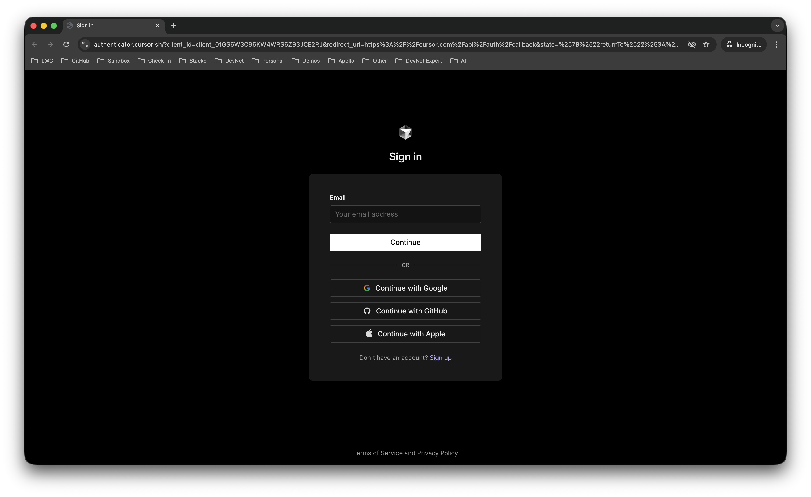
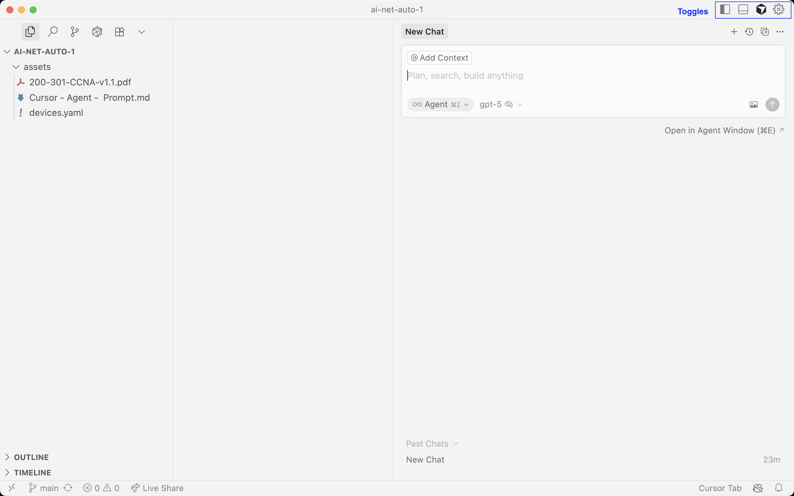
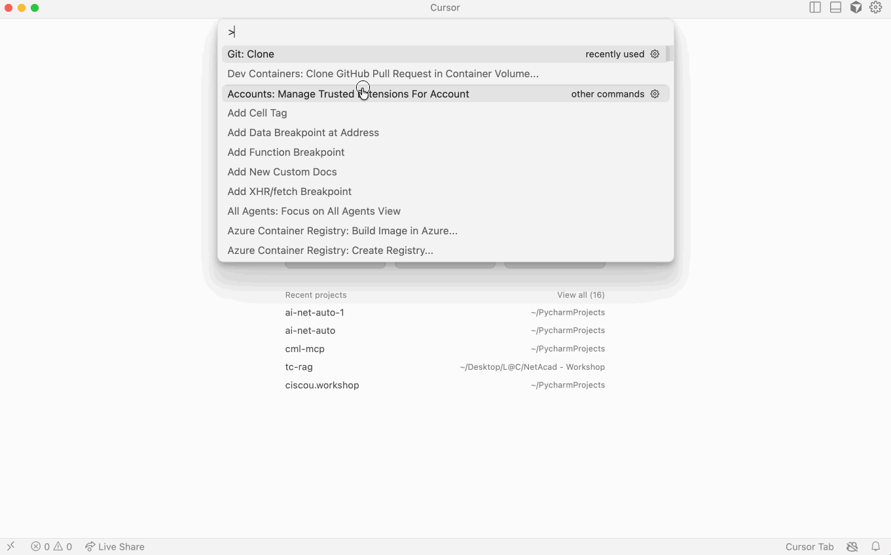
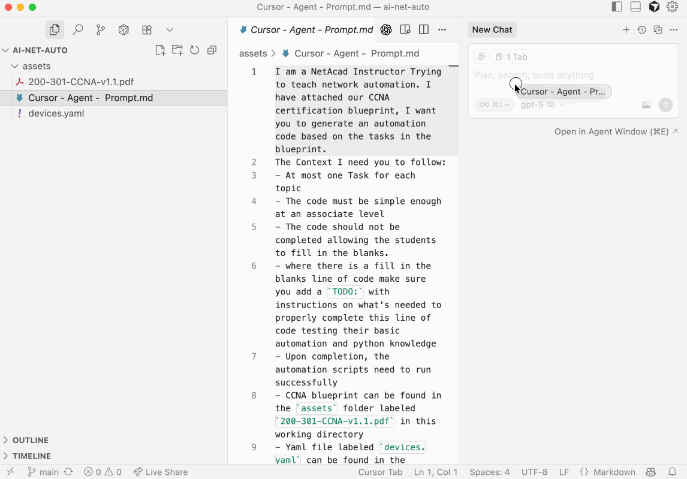

# Hands-On: Agentic AI for Network Automation 

## Introduction
In this hands-on lab, we’ll explore how **Agentic AI** can speed up the creation of network automation exercises for students.  
You’ll use **Cursor**, an AI-powered development environment, to prompt an **AI agent** with a **CCNA certification blueprint** and a **network topology YAML**.  
The agent will automatically generate:
- Student lab tasks  
- Instructor solution guides
- Supporting automation scripts  

By the end of this lab, you’ll understand how AI agents can be leveraged to **build classroom-ready network automation labs** in minutes.

---

## What You’ll Learn
- What **Cursor** is and how it works as an AI-powered development environment  
- How to set up and use **Cursor (free version)** on macOS or Windows  
- How to prompt an **AI Agent** effectively to create classroom-ready content  
- How instructors can use Agentic AI to streamline lab creation and feedback loops  

---

## What You’ll Need

- **Cursor** installed (free version) — [https://cursor.com](https://cursor.com)  
- **Git** installed — [https://git-scm.com/downloads](https://git-scm.com/downloads)

---

## Lab Steps

### Step 1 — Install Cursor (Free)

Follow the steps below to install the Cursor IDE on your system.

#### macOS Users
1. Go to [https://cursor.com](https://cursor.com) and download the **macOS installer** (`.dmg`).  
2. Open the `.dmg` file, then drag **Cursor** into **Applications**.  
3. Launch **Cursor** from your Applications folder.  
4. If macOS asks for confirmation, approve it under **System Settings → Privacy & Security**.  

#### Windows Users
1. Visit [https://cursor.com](https://cursor.com) and download the **Windows installer** (`.exe`).  
2. Run the installer and accept the default options.  
3. Launch **Cursor** from the **Start Menu**.  
4. If SmartScreen appears, choose **More info → Run anyway** (safe if downloaded from cursor.com).  

> 💡 **Tip:** Cursor’s free plan includes all the AI coding and agentic features needed for this lab.

---

### Step 2 — First Launch & Setup in Cursor

1. **Open Cursor**
    - On macOS, find it in **Applications**.  
    - On Windows, launch it from the **Start Menu**.
2. **Sign In or Create a Free Account**  
   - If you don’t already have a Cursor account, sign up for a **free account**.  
   - You can use your **GitHub** or **Google** credentials to log in.  
   - Signing in enables settings sync and AI features.  



3. **Get to Know Your Workspace**  
   - **Left Panel:** Explorer (shows project files and folders)  
   - **Center:** Code Editor  
   - **Right Panel:** Chat/Agent panel (this is where you’ll interact with the AI)  
   - If the chat panel isn’t visible, open it from **View → Chat**.  



---

#### About Cursor
Cursor is an AI-powered development environment built on top of Visual Studio Code.  
It combines a familiar coding interface with an **integrated AI agent** that can read your codebase, understand context, and help generate, refactor, or troubleshoot scripts.  
Unlike a simple chat model, Cursor connects directly to your workspace — meaning the AI can edit files, run commands, and assist with multi-step tasks.  

---

### Step 3 — Clone the Workshop Repository in Cursor

Now that Cursor is ready, let’s bring in the workshop materials you’ll use throughout this lab.

1. **Open the Command Palette**  
   - macOS: `⌘ + Shift + P`  
   - Windows: `Ctrl + Shift + P`  
   - Type **“Git Clone”** and select it from the list.
   
2. **Enter the Repository URL**  
   Paste the following GitHub repo URL when prompted:  
   ```
   https://github.com/CiscoLearning/ai-net-auto.git
   ```
   
3. **Choose a Local Folder**  
   - Select where you’d like the repo to be saved on your machine.  
   - Once the clone completes, choose **“Open in Cursor.”**  

4. **Verify the Repository Structure**  
   In the **Explorer panel**, expand the folder tree and confirm you can see:  
   - `assets/200-301-CCNA-v1.1.pdf` (CCNA blueprint)  
   - `assets/devices.yaml` (network topology/devices file)  
   - `assets/CCNA - Lab Task - Prompt.md` (the AI agent prompt file)  

  

> 💡 **Tip:** If you can see these files, your workspace is set up correctly. We’ll use them in the next step to prompt the AI agent.

---

### Step 4 — Open the Prompt File in Cursor

Now that you’ve cloned the workshop repository, it’s time to use the assets provided.

1. In the **Explorer panel**, open the `assets/` folder.  
2. Locate and open the following file:  
   ```
   CCNA - Lab Task - Prompt.md
   ```  
3. Review the content of the prompt 

---

### Step 5 — Send the Prompt to the AI Agent

Now that you’ve opened the prompt file, let’s use it to instruct the AI agent in **Cursor** to generate the lab exercises.

1. Open the **Chat/Agent panel** in Cursor.  
   - If you don’t see it, go to **View → Chat**.  

2. **Drag and drop the prompt file**  
   - In the **Explorer panel**, locate the file:  
     ```
     assets/CCNA - Lab Task - Prompt.md
     ```  
   - Drag the file directly into the chat window.  
   - This uploads the full content into the AI’s context — ensuring the model reads and executes the instructions correctly.

3. Once the file appears in the chat, type:  
    ```Prompt
    Use this file as your prompt and begin generating the lab
    ```
Then press **Enter** or **Send**.

4. **Monitor what the agent is doing.**  
You’ll see it reading the file, referencing the CCNA blueprint, and generating lab tasks in real time — pretty cool, huh?




---

### Step 6 — Review and Run the Generated Output

Once the AI agent finishes generating the lab materials, it’s time to put them to use.

1. **Scroll through the agent’s response**  
   - You’ll see generated **lab tasks**, **instructions**, and **solution examples**.  
   - The agent will include automation scripts or configuration snippets designed to run against the CML topology.  

2. **Access Your Code Server**  
   - Using the **Chrome Container** in your CML instance, access the **Code Server** IDE.
   - Navigate to the `day2/10-hands-on-ai-in-automatiom/ai-net-auto` folder — this is where your cloned repository lives.  

3. **Copy Tasks or Solutions into Code Server**  
   - Since the automation scripts depend on the CML topology, you can **copy and paste** either the **student tasks** or **instructor solutions** from Cursor into Code Server.  
   - This allows you to execute the code directly against your CML lab devices.  
   - locate the different `task` files and copy the `Python`code from your cursor workspace to your `Code Server` workspace.

   
4. **Test and Observe**  
   - Run the provided scripts or commands as described in the generated solutions.

> 💡 **Tip:** You can modify or re-run the AI prompt in Cursor to generate alternative solutions, troubleshoot scenarios, or adjust difficulty for your students.

---

### Step 7 — Review and Wrap-Up

Great work! You’ve just completed the hands-on lab on using **Agentic AI with Cursor** to create network automation exercises.

#### What You Accomplished
- Installed and set up **Cursor**  
- Cloned the **AI Network Automation** repository  
- Prompted an **AI agent** to generate student and instructor lab materials  
- Reviewed and ran automation scripts inside **Code Server** against a **CML topology**

#### Reflection
- How could you adapt this process for your own classroom or certification track?  
- Which types of automation tasks (VLANs, routing, device provisioning) would your students benefit from most?  
- What other topologies or blueprints could you use to expand this lab?  

> 💡 **Tip:** Save your generated labs — they make excellent starting points for new NetAcad activities and AI-assisted lessons.

---

## Authors and Attribution

This lab was created by the **Learn with Cisco – Technical Advocacy Team**.  
Special thanks to the **NetAcad Instructor Community** for feedback and collaboration.

## Authors and Attribution
- Created by: Kareem Iskander
- Date: 09/2025
- Version: v1.0