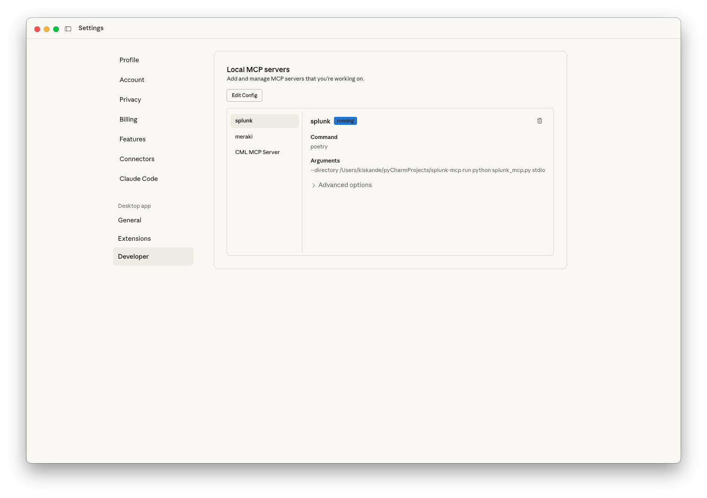
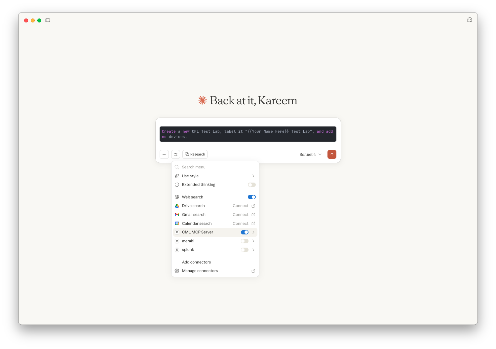
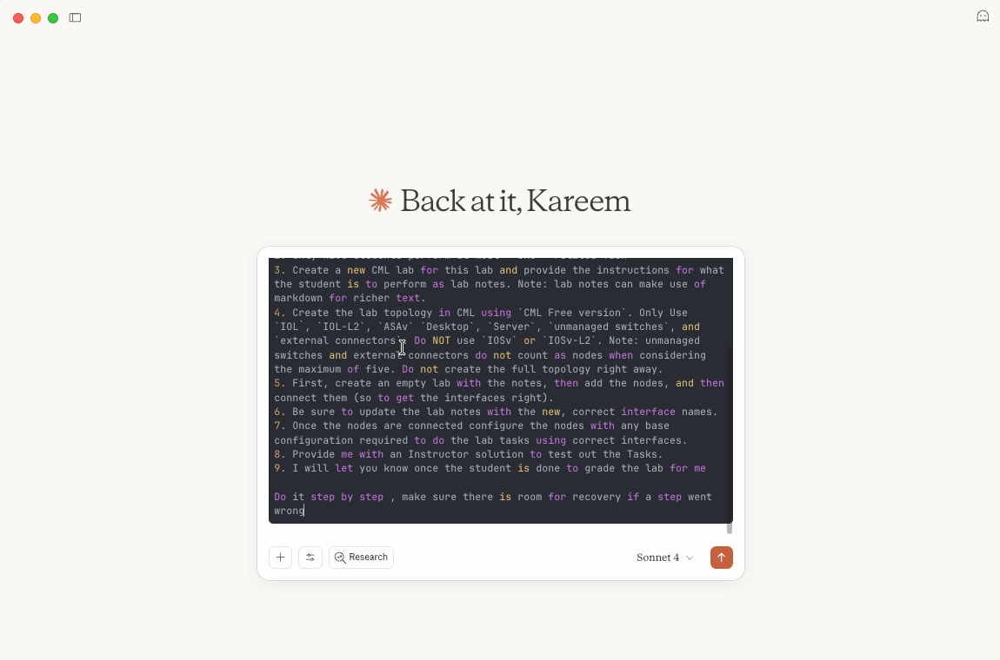

# Hands-On: MCP Powered Cisco Modeling Labs

## Introduction

This lab is all about getting hands-on with **Cisco Modeling Labs (CML)** and the **Model Context Protocol (MCP)**. You’ll explore how CML provides a powerful environment for building and testing network topologies, and how MCP adds an AI-powered layer that makes interacting with CML faster and more intuitive. By working directly with these tools, you’ll gain practical experience in setting up, configuring, and using MCP with CML.

## What You’ll Learn

In this lab, you will learn how to:
- Stand up your first **MCP server (CML MCP)**
- Use the **MCP client** to interact with the server
- Create an **AI-generated CML lab** using prompts

## What You’ll Need

- Access to a **Cisco Modeling Labs (CML) server** *(URL/credentials will be provided)*
- **Claude Desktop** installed (macOS or Windows)
- **Git** installed
  - https://git-scm.com/downloads
- A terminal/shell (Terminal on macOS, PowerShell on Windows)

## Lab Steps

### Step 1: Install and Configure UV

UV is a fast Python package and environment manager that we’ll use to run the CML MCP server. Follow the instructions for your operating system:

#### macOS
1. Open **Terminal**.
2. Install UV:
   ```bash
   curl -LsSf https://astral.sh/uv/install.sh | sh
   ```
3. Close and reopen Terminal, then verify installation:
   ```bash
   uv --version
   ```
   _[Image placeholder: terminal showing `uv --version` output]_

#### Windows
1. Open **PowerShell**.
2. Install UV:
   ```powershell
   powershell -ExecutionPolicy ByPass -c "irm https://astral.sh/uv/install.ps1 | iex"
   ```
3. Close and reopen PowerShell, then verify installation:
   ```powershell
   uv --version
   ```
   _[Image placeholder: PowerShell showing `uv --version` output]_

> ⚠️ **Recovery tip:** If `uv` is not found, make sure your shell was restarted so the PATH updates. Run the install command again if needed.

---

### Step 2: Clone and Set Up the CML MCP Server

Now that UV is installed, set up the **CML MCP server**.

1. Clone the CML MCP GitHub repository:
   ```bash
   git clone https://github.com/xorrkaz/cml-mcp.git
   cd cml-mcp
   ```
   
2. Sync the environment and install dependencies using UV:
   ```bash
   uv sync
   ```
   
> ⚠️ **Recovery tip:** if uv sync fails:
> - Make sure you `cd` into the `cml-mcp` directory before proceeding.
> - If `uv sync` fails. Run `git --version` and `uv --version`.


### Step 3: Configure the MCP Server in Claude Desktop

Now connect the CML MCP server to **Claude Desktop**.

1. Open **Claude Desktop** → **Settings** → **Developer** → **Edit Config** → **claude_desktop_config.json**.  
   - macOS: `~/Library/Application Support/Claude/claude_desktop_config.json`  
   - Windows: `%APPDATA%\Claude\claude_desktop_config.json`  

2. Paste the following JSON into your config:

> ⚠️ask your instructors for the CML & PYATS credentials to fill in the placeholders below.

   ```json
   {
     "mcpServers": {
       "Cisco Modeling Labs MCP Server": {
         "command": "uvx",
         "args": ["cml-mcp"],
         "env": {
           "CML_URL": "<URL_OF_CML_SERVER>",
           "CML_USERNAME": "<USERNAME_ON_CML_SERVER>",
           "CML_PASSWORD": "<PASSWORD_ON_CML_SERVER>",
           "PYATS_USERNAME": "<DEVICE_USERNAME>",
           "PYATS_PASSWORD": "<DEVICE_PASSWORD>",
           "PYATS_AUTH_PASS": "<DEVICE_ENABLE_PASSWORD>"
         }
       }
     }
   }
   ```

3. Save the file and **fully restart** Claude Desktop.

4. Verify the MCP server is running:
   - Open **Claude Desktop** → **Settings** → **Developer**.
   - You should see **Cisco Modeling Labs MCP Server** listed and running.
   



---

### Step 4: Verify the MCP Server with a Test Prompt

Now that the MCP server is configured in Claude Desktop, let’s make sure it’s working correctly.

1. Open **Claude Desktop**.  
2. In the main chat window, enter the following test prompt:  
   ```
   Create a new CML Test Lab, label it "{{Your Name Here}} Test Lab", and add no devices.
   ```


3. If everything is configured correctly, Claude will respond by generating a new empty CML lab in your connected server.
4. verify the lab was created by logging into the **CML server** and checking for the new lab under your name.

> ⚠️ **Recovery tip:** If the server does not respond, go back to Step 3 and confirm your JSON config is correct, and verify that the CML URL/credentials are valid.

---

### Step 5: Generate a CCNA‑Focused CML Lab from a Prompt

With the MCP server verified, we can now leverage AI with CML to build hands‑on content that helps students learn networking, grow into better network engineers, and prepare for their CCNA certification.

In this step, we’ll begin creating a **CCNA-focused use case**. The **CCNA exam blueprint** (provided in the `/assets` folder of this hands-on) will guide the scope of the lab, and the **prompt** we’ll use is provided in the file `CCNA - Lab Task - Prompt.md` in the same directory.




1. Open **Claude Desktop**.
2. Open the file `CCNA - Lab Task - Prompt.md`.
   - Prompt can be found in the `/assets` folder as `CCNA - Lab Task - Prompt.md` 
   - **Copy** all the contents of the file.
   - **Paste** the contents into the Claude message composer.
   - 🛑 **DO NOT** press send yet.
3. **Attach the CCNA blueprint PDF** from the `/assets` folder to your message: `200-301-CCNA-v1.1.pdf`.  
   - Drag-and-drop the PDF into the Claude message composer, or click the **paperclip** icon and select the file.  
   - Confirm the file shows as an attachment before sending.
4. Examine the prompt and press **Send** to submit the request to Claude.
5. Claude should generate a **discovery lab in CML** based on the CCNA blueprint, including lab notes and a small topology.
6. As Claude works, monitor the progress of the AI, expanding any sections that show progress. This may take several minutes.
7. You can also navigate to your CML instance to watch the lab being built in real time.
6. In your **CML** web UI, confirm:  
   - A new lab exists with the name requested by the prompt.  
   - **Lab Notes** were created and reference the correct interface names.  
   - The topology uses only the allowed node types for CML Free (`IOL`, `IOL-L2`, `ASAv`, `Desktop`, `Server`) and may include `unmanaged switches` and `external connectors` (which do not count against the node limit).  

> ⚠️ **Recovery tip:** If the lab fails to generate, make sure the MCP server shows as **Running** in Claude Desktop (**Settings → Developer**), verify the CCNA PDF is attached, and confirm that the `/assets` blueprint and the `CCNA - Lab Task - Prompt.md` file are present.

---

### Step 6: Explore and Complete the Generated Lab

Now that the CCNA-focused lab has been generated, it’s time to explore and practice.

1. Log into your **Cisco Modeling Labs (CML)** web interface.  
2. Open the lab created in `Step 5`.  
3. On the top nav bar, navigate to **Guide**.  
   - Review the lab tasks listed. These are the hands-on exercises for you (your students) to complete.
4. Begin working through the tasks:  
   - You can attempt them manually by configuring devices and verifying connectivity.  
   - Or, if you want to speed things up, Ask **AI** to **Generate a brief Instructor solution I can Copy/Paste** to copy/paste and solve the tasks quickly.  
  

> 💡 **Tip:** Don’t hesitate to try both approaches — completing tasks manually builds skill, while using the Instructor solution lets you quickly see the end-to-end workflow.

---

### Step 7: Grade the Lab with Claude Desktop

Once you have completed the tasks in CML, it’s time to evaluate your work using Claude Desktop.

1. Return to **Claude Desktop**.  
2. In the chat, type a message such as:  
  ```
   Grade the CCNA discovery lab I just completed in CML.
  ```
3. Claude will connect to the MCP server, review the state of the lab, and provide feedback on whether the tasks were completed correctly.  
4. If there are mistakes or incomplete configurations, Claude will highlight them and suggest fixes.  
5. Optionally, you can intentionally make small mistakes in your CML lab before grading to see how Claude identifies and responds.  

> 💡 **Tip:** Using Claude to grade labs provides immediate feedback and shows the potential of AI‑powered lab evaluation for instructors and students.

---

## Review and Wrap-Up

### What you accomplished
- ✅ Created your first **MCP Server**
- ✅ Connected to it using the **MCP Client and Host (Claude)**
- ✅ Saw the value of bringing **AI into the classroom** while leveraging **CML** for learning


### Reflection
- Where did MCP save you time compared to a manual CML workflow?
- Which task would you automate next with a tailored prompt?
- How can you help your instructors use this in their classrooms?

---

## Clean Up

To wrap up this lab, return your environment to a clean state:

- In **Cisco Modeling Labs (CML)**:
   - Stop any running labs you created.
   - Delete the test lab(s) generated during this exercise if you no longer need them.

## Authors and Attribution
- Created by: Kareem Iskander
- Date: 09/2025
- Version: v1.0